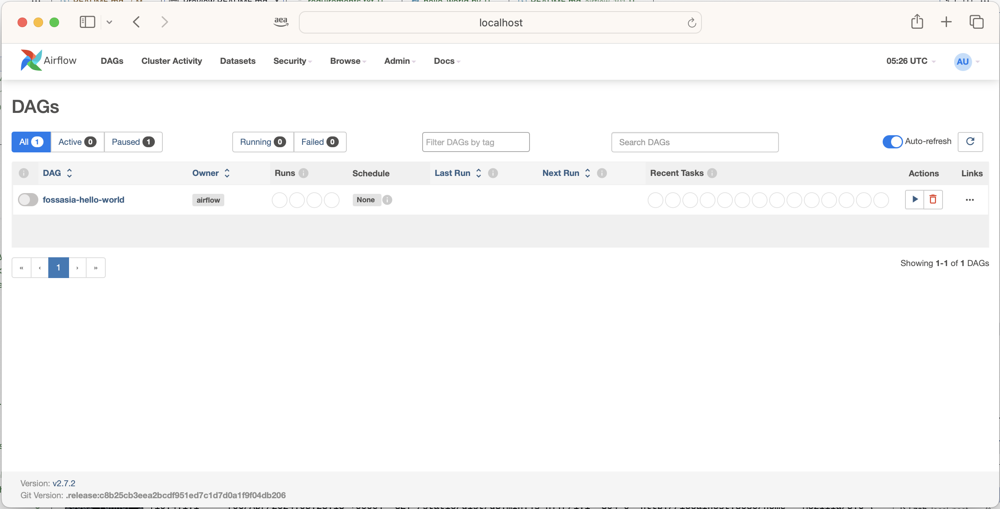
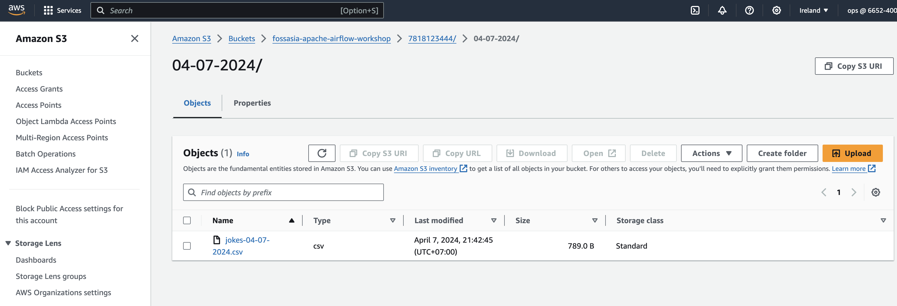

# Getting started with Apache Airflow - building your first workflow

This is an entry level workshop that will get you started with Apache Airflow. It is designed for people who have never used it before, and so there is no prior experience needed. That said, there are some assumptions I have made, which are:

* you have a basic understanding of how Python works
* you will have a laptop that has git, docker, and docker-compose installed and working
* your laptop will have enough cpu and memory (2 cores, 4 gb ram)
* Python 3.10 or later

In this workshop, we will be going over the following topics

* Setup and Installation
* An overview of Apache Airflow
* Deploying our first workflow
* Running our first workflow
* Building, Deploying and Running our workshop DAG
* Cleaning up
* Resources 

We will be building a simple workflow that is going to help us build a Joke repository.


We are going to access a well know API to retrieve 10 latest jokes. We will then build a workflow that allows us to save these to an Amazon S3 bucket, and then once cleaned up, we will ingest these into our PostgreSQL database (which we will be running locally)

**Checking out this repository**

Choose a working directoy, and then check out the workshop using git

```
git clone https://github.com/094459/fossasia-airflow.git

```

We will be following the README.md file, which you can access now locally within that repo, or [access it online](https://github.com/094459/fossasia-airflow)

## Setup and Installation

There are many ways in which we can run Apache Airflow, but for this workshop we are going to use an open source project from AWS that makes using Airflow a breeze.

[mwaa-local-runner](https://github.com/aws/aws-mwaa-local-runner)

I have prepared everything you need in a repo for this workshop, so lets get started.

**1 - Lets check out dependencies**

We will be running Airflow via containers, and so you will need Docker/Docker Compose, or alternatively an open source alternative, like [Finch](https://runfinch.com/docs/getting-started/installation/) - I will be using Finch, but Docker will workk equally well.

> **What is Finch?** Finch is an open source tool for local container development. You can read up about it [here](https://runfinch.com/) - it is awesome, and under the covers it is using lima, containerd, nerdctl, buildkit, and a few other open source tools to make it just work. It is also command line compatible with docker, which means that for most operations, you can simply switch out docker for finch.

We also need to make sure that we have enough resources to run these containers - I have found these work fine with 2vCPUs and 4GB of RAM, as well as 50Gb of free disk space.

*Windows Users*

There is an experimental script called mwaa-local-env.ps1 that should allow those who are running new versions of Windows to run this workshop. You will need to make sure you have [Docker and Docker-compose installed.](https://docs.docker.com/desktop/install/windows-install/) 

**2 - Create a new Python virtual environment**

It is always good practice to start with a clean Python virutal environment.

```
mkdir fossasia-airflow-workshop
cd  fossasia-airflow-workshop
python -m venv airflow
cd airflow
source bin/activate
```
which if successfull, you should see

```
(airflow)$
```

> **Note!** We will refer to this directory as the [airflow] directory. Where ever you see [airflow] mentioned, this is where you need to navigate to.

**3 - Clone to workshop repository**

Clone the workshop into the directory you created in step 2.

```
git clone https://github.com/094459/fossasia-airflow.git
cd fossasia-airflow
```

This contains everything we will need.

```
├── LICENSE
├── README.md
├── airflow-101
│   ├── README.md
│   ├── mwaa-local-runner
│   │   ├── db-data
│   │   ├── docker
│   │   │   ├── Dockerfile
│   │   │   ├── config
│   │   │   │   ├── airflow.cfg
│   │   │   │   ├── constraints.txt
│   │   │   │   ├── mwaa-base-providers-requirements.txt
│   │   │   │   ├── webserver_config.py
│   │   │   │   └── .env.localrunner
│   │   │   ├── docker-compose-local.yml
│   │   │   ├── docker-compose-resetdb.yml
│   │   │   ├── docker-compose-sequential.yml
│   │   │   ├── finch-local.yml
│   │   │   ├── finch-resetdb.yml
│   │   │   └── script
│   │   │       ├── bootstrap.sh
│   │   │       ├── entrypoint.sh
│   │   │       ├── generate_key.sh
│   │   │       ├── run-startup.sh
│   │   │       ├── shell-launch-script.sh
│   │   │       ├── systemlibs.sh
│   │   │       └── verification.sh
│   │   ├── mwaa-finch-local-env
│   │   ├── mwaa-local-env
│   │   ├── startup_script
│   │   │   └── startup.sh
│   │   └── workflow
│   │       ├── dags
│   │       │   └── custom-constraints-2.7.2-3.11.txt
│   │       ├── dev-dags
│   │       │   ├── hello-world.py
│   │       │   ├── jokes-postgres-workshop.py
│   │       ├── plugins
│   │       │   └── README.md
│   │       └── requirements
│   │       │   └── requirements.txt
│   │       └── scripts
│   │            └── jokes.py
│   └── local-postgres
│       └── postgres-local.yml
```

**4 - Update configuration files**

We are going to update some of the configuration files, which we need to do before we build our Airflow container images.

When you are experimenting with Airflow, you might want to make some changes to the airflow.cfg file which is the main file that configures all aspects of how Airflow works. For experimentation and development, we want to make a few changes

1. Update how frequently Airflow scans the DAGS folder

In order to reduce the time it takes for a DAG to be scanned by Airflow, we can change the following configuration option. (line 783)

```
# How often (in seconds) to scan the DAGs directory for new files. Default to 5 minutes.
dag_dir_list_interval = 300
```

We can change this to something like 5 seconds

```
# How often (in seconds) to scan the DAGs directory for new files. Default to 5 minutes.
dag_dir_list_interval = 5
```

2. Enabling the REST API

Some of the developer tools that you can use in IDEs like VSCode, require that you have the REST API available. By default, this is not enabled in mwaa-local-runner, so we will need to change this. (line 369)

```
[api]

# How to authenticate users of the API. See
# https://airflow.apache.org/docs/apache-airflow/stable/security.html for possible values.
# airflow.api.auth.backend.sessions is required in auth_backends and 
# airflow.api.auth.backend.deny_all doesn't limit the API for airflow v2.3+
auth_backends = airflow.api.auth.backend.session
```

to

```
[api]
auth_backends = airflow.api.auth.backend.basic_auth
```

You can read more about the available options [here](https://airflow.apache.org/docs/apache-airflow/stable/security/api.html)

3. Other important configuration files and directories

There are a number of interesting configuration files you which we will not change, but you should be aware of if you want to use this project going forward.

* .env.localrunner - (config directory) this configuration file contains some important environment variables that are passed into the running Airflow containers. This is useful, for example, if you want to pass in your AWS Credentials this way. You can also change the default admin password that gets created (which is test) by changing that value in this configuration file.

> **Be aware!** As always **be very careful** about updating this file to include these, we will be storing the credentials within the Airflow metastore, where they are encrypted.
* docker-compose files - (docker directory) there are a number of docker compose files (docker-compose, and finch-) that are used to start Airflow and supporting services, including a PostgreSQL database. Also of note is the configuration to mount several local folders into these running containers, which is how we will be able to develop/work locally, whilst these containers are running. We can see from the following, that we are mapping our Airflow DAGs folder, as well as other supporting folders into key directories that Airflow expects. Within the directory structure, you can see where the source directories are (within the workflow directory)

```
            - "${PWD}/workflow/dags:/usr/local/airflow/dags"
            - "${PWD}/workflow/plugins:/usr/local/airflow/plugins"
            - "${PWD}/workflow/requirements:/usr/local/airflow/requirements"
            - "${PWD}/startup_script:/usr/local/airflow/startup"
```
* startup.sh - (startup_script directory) this file allows you to configure additinal dependencies (binaries, libraries, etc) that you want available within your Airflow environment, which is useful if you want to be using some Operators that have additional dependencies.
* workflow - this directory contains several folders, and will be the main working area we will be using to develop our workflows.


**5 - Building Airflow container images**

We are now ready to build our Airflow images. This process will take approx 15 mins, so once we have kicked this off we will then move into thoery of Airflow, before resuming.

The mwaa-local-runner repo comes with a script that we will use to build, start, and stop Airflow. We can run this command without parameters

If using Docker

```
cd airflow-101/mwaa-local-runner
chmod +x mwaa-local-env
./mwaa-local-env

```

If using Finch

```
cd airflow-101/mwaa-local-runner
chmod +x mwaa-finch-local-env
./mwaa-finch-local-env

```

And we will get the following output.

```
======================================
   MWAA Local Runner CLI
======================================
Syntax: mwaa-local-runner [command]
Airflow version 2_7
---commands---
help                   Print CLI help
build-image            Build Image Locally
reset-db               Reset local PostgresDB container.
start                  Start Airflow local environment. (LocalExecutor, Using postgres DB)
stop                   Stop Airflow local environment. (LocalExecutor, Using postgres DB)
test-requirements      Install requirements on an ephemeral instance of the container.
package-requirements   Download requirements WHL files into plugins folder.
test-startup-script    Execute shell script on an ephemeral instance of the container.
validate-prereqs       Validate pre-reqs installed (docker, docker-compose, python3, pip3)
```

We are going to use the "build-image" feature, to kick off our build.

If you are using Docker

```
cd airflow-101/mwaa-local-runner
./mwaa-local-env build-image
```

If you are using Finch

```
cd airflow-101/mwaa-local-runner
./mwaa-finch-local-env build-image
```

And you should start to see the build process kicking off

```
./mwaa-finch-local-env build-image
[+] Building 12.9s (22/25)                                                                                                                             
 => [ 1/21] FROM docker.io/library/amazonlinux:2023@sha256:860843fc1dcf21cb06ce7a5cd0a6da92e9cb76bb8e0d1517fd93b6b8e2fa31bc                       0.9s
 => => resolve docker.io/library/amazonlinux:2023@sha256:860843fc1dcf21cb06ce7a5cd0a6da92e9cb76bb8e0d1517fd93b6b8e2fa31bc                         0.9s
 => [internal] load build context                                                                                                                 0.1s
 => => transferring context: 74.36kB                                                                                                              0.0s
 => CACHED [ 2/21] COPY script/bootstrap.sh /bootstrap.sh                                                                                         0.0s
 => CACHED [ 3/21] COPY script/systemlibs.sh /systemlibs.sh                                                                                       0.0s
 => CACHED [ 4/21] COPY script/generate_key.sh /generate_key.sh                                                                                   0.0s
```

The time this takes will vary, but on a good network, it will be around 10-15 minutes. When it is complete, you should see a message like

```
 => exporting to docker image format                                                                                                             21.5s
 => => exporting layers                                                                                                                           0.8s
 => => exporting manifest sha256:9b931a5e841d6a08bd40e5cd35d606fe0bc0b28420e571a41585a9e850826889                                                 0.0s
 => => exporting config sha256:5d066924b20dd0c11aa44df8f182a653b907bf28c0da65c096abdea87bdf6b7b                                                   0.0s
 => => sending tarball       
```

Whilst we are waiting to our Airflow container images to be built, lets take a look at the architecture and core concepts that we will be working with in Apache Airflow.

## An overview of Apache Airflow

We will be walking through the high level concepts of Apache Airflow, a look at the architecture, and then what we will be building once we have Airflow up and running.

[link to airflow slides](slides/ricsue-airflow-101-fossasia.pdf)


## Starting Apache Airflow

**1 - Checking the containers are available**

We can now start Apache Airflow. First we will make sure that the container images are ready and available for us.


If using Docker,

```
docker image ls | grep mwaa
docker image ls | grep postgres
```

If using Finch,

```
finch image ls | grep mwaa
finch image ls | grep postgres
```

And you should see something like

```
amazon/mwaa-local                                                 2_7          9b931a5e841d    5 minutes ago    linux/arm64       3.3 GiB      1.0 GiB
postgres                                                          11-alpine    ea50b9fd617b    3 minutes ago    linux/arm64/v8    236.2 MiB    85.5 MiB
```

**2- Starting Airflow**

To start Airflow, we use the mwaa-local-env/mwaa-finch-local-env script.

If you are using Docker

```
cd airflow-101/mwaa-local-runner
./mwaa-local-env start
```

If you are using Finch

```
cd airflow-101/mwaa-local-runner
./mwaa-finch-local-env start
```

and you should see output of the following

```
./mwaa-finch-local-env start
INFO[0000] Creating network aws-mwaa-local-runner-2_7_default
WARN[0000] Ignoring: service local-runner: [EnvFile HealthCheck]
WARN[0000] Ignoring: service local-runner: depends_on: postgres: [Required]
WARN[0000] found 1 orphaned containers: [0x4000aca1c0], you can run this command with the --remove-orphans flag to clean it up
INFO[0000] Ensuring image postgres:11-alpine
INFO[0000] Ensuring image amazon/mwaa-local:2_7
INFO[0000] Creating container aws-mwaa-local-runner-2_7-postgres-1
INFO[0000] Creating container aws-mwaa-local-runner-2_7-local-runner-1
INFO[0000] Attaching to logs
postgres-1     |

```
and will run for a minute or so, before you see the following output

```
local-runner-1 |[2024-04-05 07:13:08 +0000] [188] [INFO] Starting gunicorn 21.2.0
local-runner-1 |[2024-04-05 07:13:08 +0000] [188] [INFO] Listening at: http://0.0.0.0:8080 (188)
local-runner-1 |[2024-04-05 07:13:08 +0000] [188] [INFO] Using worker: sync
local-runner-1 |[2024-04-05 07:13:08 +0000] [192] [INFO] Booting worker with pid: 192
```

When you see this, you can now open a browser window, and open http://localhost:8080, which should pop up the Apache Airflow login page. 


To login, we use the default password (which is username, 'admin', with a password of 'test'), which should then take you to the Airflow home page.


Congratulations, you are now ready to start building your first workflow. We will leave this terminal running whilst we complete the rest of the workshop, and come back at the end to show you how to stop and clean up everything.


## Deploying our first Workflow

Now that we have Airflow up and running, lets deploy a demo workflow that will just get us warmed up. If we go into the workflow directory, this is where we will be creating and deploying our workflows.

```
workflow
│
├── dags
│   └── custom-constraints-2.7.2-3.11.txt
├── dev-dags
│   ├── hello-world.py
│   ├── jokes-postgres-workshop.py
├── plugins
    └── README.md
    ├── requirements
    │   └── requirements.txt
    └── scripts
       └── jokes.py
```

**1. Exploring the hello-world.py**

Open up the hello-world.py file, and lets take a look at what it does.

```
from airflow import DAG
from airflow.utils.dates import days_ago
from airflow.operators.bash_operator import BashOperator

with DAG(
    dag_id="fossasia-hello-world",
    schedule_interval=None,
    catchup=False,
    start_date=days_ago(1)
    ) as dag:

    env_aws_identity = BashOperator(
        task_id="calling_fossasia",
        bash_command="echo FOSSAISA is cool"
    )
```

As we can see, our workflow (DAG) is just a regular python file. The first thing we can see is that there are some import statements, where we load up Python libraries. 

When creating your DAG, you will always import the first two. All DAGs start off by importing the DAG class, and all DAGs need to have a specified start_data value (in this instance I am importing days_ago, but you can use others such as datetime).

In this simple Hello World DAG, we are going to use one of Airflow's operators to output some text to the console, so we will be using the BashOperator. So we add another import (don't worry, we will come to where these come from in the next section). Every Operator works differently (although there are many things that look and behave the same to make it easier on developers), and we will see what that looks like in a sec.

We now instantiate our workflow with the "with DAG() as dag:" statement, and we provide some information that you will need to provide for every workflow:

* a unique id for the workflow, the dag_id - in this case, we explicitly give it a name ("fossasia-hello-worl"d), but you can auto-generate these too. I often create a variable that generates the dag_id as the file name (DAG_ID = os.path.basename(__file__).replace('.py', ''))
* schedule_interval - this is how we want to schedule our task, either via a cron like schedule, or not scheduling it at all and making it so that this is just running on demand
* catchup - configures whether we want our DAG to start from the beginning of where the start_date is defined, or whether we want to disable that.
* start_date - this is where we want to position the starting point for our DAG, and is used by the scheduler to trigger runs of this workflow based on the schedule_interval from this start_date (unless disabled by catchup=False)

There are lots of other parameters you can set, this is just a small selection. I have yet to find a good source of documentation that covers these, but you can [review the Airflow documentation](https://airflow.apache.org/docs/apache-airflow/stable/tutorial/fundamentals.html) and dig around. We will be introducing some others later.

So we now have our DAG object, now we need to define our one and only task. As we have imported the BashOperator, we are going to use that. How do we know how to do that? Well, the Airflow reference guide is our companions, and you can [review the BashOperator](https://airflow.apache.org/docs/apache-airflow/stable/howto/operator/bash.html) docs to see what we can expect.

And that is it, we save our file and we have now created our first hello-world DAG, that just echos something to stdout.

**2. Airflow Provider Packages**

One of the strengths of Apache Airflow is the way that it allows you to bring in Operators that work with downstream systems. There are hundreds of these, and they make creating your workflows much easier.

[Provider Packages](https://airflow.apache.org/docs/apache-airflow-providers/index.html) allow Airflow to maintain a modular architecture, separating out the core features from those of the systems you need to work with. As such, it is up to you to determine which Operators you need to use when building your DAGs, and then install and import these libraries as needed.

There are too many to list, but [check out this page](https://airflow.apache.org/docs/) which just lists some of the active ones. You can click on those links, and each one will drill down into more details as to what functionality is supported.

>**Note!** On the top left, you will see a "VERSION:XX.XX.XX" pull down, which allows you to switch to different versions of the Operator, to make sure that what you are working on is what you will get. Make sure you double check this.

Of course, the beauty of Airflow is that because it is open source, it allows you to extend, or create new Operators to suit your needs.

**3. Installing Provider packages**

Each Operator has its own PyPi package which needs to be installed. You will need to determine this by looking at the documentation, and then install them. Check out the details for the [Amazon Provider package](https://pypi.org/project/apache-airflow-providers-amazon/).

Whilst we are developing our workflows, we can install these Operators in our local Python environments, but how do we do make sure that when we deploy these on the Airflow server, those Operators will be there?

If we look at the "workflows" directory we can see a directory called "requirements" 

```

workflows
│
├── dags
├── plugins
└── requirements
    └── requirements.txt

```

and within this a file called requirements.txt

```
--constraint "https://raw.githubusercontent.com/apache/airflow/constraints-2.7.2/constraints-3.11.txt"

apache-airflow-providers-snowflake==5.0.1
```

When we want to make our Operators available within Airflow, we will need to update this file. In the example we can see we have added the snowflake provider (we are not going to use it, this was just an example)

Airflow will amke sure all these are installed by the workers when your tasks are executed.


**4. Managing Python dependencies**

One of the biggest challenges when creating your workflows, is making sure that as you use and depend upon additional Python libraries and Apache Operators, you don't break Airflow. It is surprisingly easy to due, in part due to having to manage the compatibility of your Python libraries across the versions they themselves have (and their dependencies), the libraries that Airflow requires, and of course, the versions of Python you are running.

To reduce the risk of issues, the Airflow project introduced [constraints.txt](https://airflow.apache.org/docs/apache-airflow/stable/installation/installing-from-pypi.html#constraints-files). These are published on GitHub, and are generated by the Airflow build process across different versions of Airflow and Python.

```
--constraint "https://raw.githubusercontent.com/apache/airflow/constraints-2.7.2/constraints-3.11.txt"
```

In this example, we can see that we are using the constraints file for Airflow 2.7.2, for Python 3.11. This is the version that the mwaa-local-runner is using.

If we attempt to add libraries into our requirements.txt that clash with these, then Airflow will halt and generate an error. You can test this out yourself by trying to do the pip install (see the resources section at the end for an exmaple).

One of the challenges that can happen however, is that given the pinned versions of the libraries in this constraints file, how do you update a version of one of the Airflow Operators you might want to use? If you need to use a later version, then there is a way. However, before you proceed down this route, remember that these constraints files have been validated by the Airflow build system, so you will be potentially running into the unknown.

To override a dependency that is in the constraints file, we first create a copy of the baseline constraints file (so in our example above, the "https://raw.githubusercontent.com/apache/airflow/constraints-2.7.2/constraints-3.11.txt" ), and update the pinned version. We then save this copy into our DAGS directory. If you take a look at the directory, you will see we have already created one (called "custom-constraints-2.7.2-3.11.txt").

```
├── dags
│   └── custom-constraints-2.7.2-3.11.txt
├── dev-dags
├── plugins
└── requirements
    └── requirements.txt

```

We then need to adjust our requirements.txt file to use this version of the constraints file, rather than the one that Airflow has published on GitHub. If we look at our requirements.txt, we can see we can do this by adding the following line:

```
--constraint "/usr/local/airflow/dags/custom-constraints-2.7.2-3.11.txt"
```

and then commenting out the original one, so our finished file looks like

```
# --constraint "https://raw.githubusercontent.com/apache/airflow/constraints-2.7.2/constraints-3.11.txt"

--constraint "/usr/local/airflow/dags/custom-constraints-2.7.2-3.11.txt"

apache-airflow-providers-snowflake==5.0.1
```

Airflow will now use this updated constraints file which we have more control over. When Airflow starts, we can see the following message in the logs:

```
local-runner-1 |--constraint "https://raw.githubusercontent.com/apache/airflow/constraints-2.7.2/constraints-3.11.txt"
local-runner-1 |# --constraint "/usr/local/airflow/dags/custom-constraints-2.7.2-3.11.txt"
local-runner-1 |Installing requirements.txt
local-runner-1 |Collecting apache-airflow-providers-snowflake==5.0.1
```


**5. Deploying the workflow (DAG)**

Now that we have covered how Airflow manages our DAGs Python dependencies, we can deploy it. All we need to do is copy the file into the DAGS folder. That is it.

If we open up the Airflow UI, after a few seconds, we now see something appear.



Lets now explore the Apache Airflow UI, now that we have a DAG to work with.

**6. Exploring our workflow (DAG) in the Airflow UI**

Spend 5 minutes exploring the UI - there is not specific guide here, although make sure you check out the following:

* Review the top menu bar - explore the ADMIN menu, which we will be coming back to later. You can also check which Provider packages you have installed here, which is very handy for troubleshooting issues.
* Open up the DAG - you can open up your DAG, and explore the differnt ways you can view tasks, as well as the different ways that Airflow reports data on the status of your DAGs over time. Also, make sure you see how you can view the code of your DAG by clicking onthe CODE menu.
* Review the coloured status options - Airflow uses different coloured outlines to inform you the status of your tasks in your DAG, so make sure you review those

## Running our first workflow

**1. Running our DAG**

When we copied our DAG into the DAGs folder, Airflow was able to see it. However, at this stage the DAG is in paused state, and will not run. We need to un-pause it before we can run it. So we need to un-pause it changing the toggle (on the left hand side, next to the DAG id)

When we created our DAG, we specified that the DAG would be run on demand and not via a schedule ("schedule_interval=None"), so now that we have it unpaused, we can then click on the > icon to trigger the DAG (under the ACTIONS icon on the right hand side)

When we do that, you will see that under the Runs the status will change to a bright green colour (looking at the status colours, we can see this means RUNNING). If we click to open up our DAG, we will see that we can see our task (calling_foassasia) and we have a dark green bar next to it. Looking at the status colours, we can see that this is good - SUCESS.


If we hovver over the task, we can click on the small dark green box. When you have more complex DAGs with many tasks, you will see separate lines for each task, each with their own status colour, allowing you to interact and inspect each task independantly.


If we click on this, we can open the details for THIS SPECIFIC task run. This is super important as this is one of the really nice things about Airflow. You are able to go back in time to every instance of your DAGs tasks, and dig into to get information about what happened.


And if we click on the LOG menu option, we can see the output of our task.


Spend a few minutes exploring some of the other options in the task run screen.

Before we do the next excercise, pause the DAG by clicking on the toggle icon.

**2. Modifying our DAG to run on a schedule**

We are now going to modify the DAG so that it runs on a schedule, so you can see what this looks like.

Edit the hello-world.py (you can edit the one you copied into the DAGs folder), and edit the line

```
    schedule_interval=None,
```

to

```
    schedule_interval='*/2 * * * *',
```

And save the file. What we have done is configure our DAG to run every two minutes.

> **Handy Resource!** To help you build your cron expressions, you can try out [this online cron expression builder tool](https://crontab.cronhub.io/)

Because we paused the DAG at the end of the previous step, nothing much happens. Un-pause the DAG again by toggling the pause icon, which should start off the DAG.

If you are quick, you will notice a few things in the logs that appear.

```
local-runner-1 |[2024-04-06T13:59:49.514+0000] {{scheduler_job_runner.py:414}} INFO - 1 tasks up for execution:
local-runner-1 |        <TaskInstance: fossasia-hello-world.calling_fossasia scheduled__2024-04-06T13:56:00+00:00 [scheduled]>
local-runner-1 |[2024-04-06T13:59:49.514+0000] {{scheduler_job_runner.py:477}} INFO - DAG fossasia-hello-world has 0/16 running and queued tasks
local-runner-1 |[2024-04-06T13:59:49.514+0000] {{scheduler_job_runner.py:593}} INFO - Setting the following tasks to queued state:
local-runner-1 |        <TaskInstance: fossasia-hello-world.calling_fossasia scheduled__2024-04-06T13:56:00+00:00 [scheduled]>
local-runner-1 |[2024-04-06T13:59:49.516+0000] {{scheduler_job_runner.py:636}} INFO - Sending TaskInstanceKey(dag_id='fossasia-hello-world', task_id='calling_fossasia', run_id='scheduled__2024-04-06T13:56:00+00:00', try_number=1, map_index=-1) to executor with priority 1 and queue default
local-runner-1 |[2024-04-06T13:59:49.516+0000] {{base_executor.py:144}} INFO - Adding to queue: ['airflow', 'tasks', 'run', 'fossasia-hello-world', 'calling_fossasia', 'scheduled__2024-04-06T13:56:00+00:00', '--local', '--subdir', 'DAGS_FOLDER/hello-world.py']
local-runner-1 |[2024-04-06T13:59:49.520+0000] {{local_executor.py:87}} INFO - QueuedLocalWorker running ['airflow', 'tasks', 'run', 'fossasia-hello-world', 'calling_fossasia', 'scheduled__2024-04-06T13:56:00+00:00', '--local', '--subdir', 'DAGS_FOLDER/hello-world.py']
local-runner-1 |[2024-04-06T13:59:49.549+0000] {{dagbag.py:536}} INFO - Filling up the DagBag from /usr/local/***/dags/hello-world.py
local-runner-1 |Changing /usr/local/airflow/logs/dag_id=fossasia-hello-world/run_id=scheduled__2024-04-06T13:56:00+00:00/task_id=calling_fossasia permission to 509
local-runner-1 |[2024-04-06T13:59:50.465+0000] {{dagrun.py:653}} INFO - Marking run <DagRun fossasia-hello-world @ 2024-04-06 13:56:00+00:00: scheduled__2024-04-06T13:56:00+00:00, state:running, queued_at: 2024-04-06 13:59:49.465479+00:00. externally triggered: False> successful
local-runner-1 |[2024-04-06T13:59:50.465+0000] {{dagrun.py:704}} INFO - DagRun Finished: dag_id=fossasia-hello-world, execution_date=2024-04-06 13:56:00+00:00, run_id=scheduled__2024-04-06T13:56:00+00:00, run_start_date=2024-04-06 13:59:49.485738+00:00, run_end_date=2024-04-06 13:59:50.465828+00:00, run_duration=0.98009, state=success, external_trigger=False, run_type=scheduled, data_interval_start=2024-04-06 13:56:00+00:00, data_interval_end=2024-04-06 13:58:00+00:00, dag_hash=b18d787731d5088ac45d38d89d8df5a8
```

If you keep watching the logs, you should see these appear every two minutes. After a few minutes, when we go back to the Apache Airflow UI, you will notice that we can see that from the main DAG dashboard, we can see that our DAG now has the scheduling information to inform us that this is now a scheduled DAG.


And when we open up the DAG, we can now see that we have multiple tasks that have been succesfully completed.


Lets pause the DAG again, by toggling the icon next to the DAG id

**3. Using Airflow Variables**

As you begin to create your DAGs, you want to make sure that you maximise the re-use by reducing hard coded values. Airflow allows you define variables, which you can then access in your DAGs.

In our hello world example, rather than hard code the message we output, lets change this to outputting the value of a variable we store, called "event".

We can define a variable using the Apache Airflow UI, under the ADMIN menu option. If you select VARIABLES, you will see a blank page - this is to be expected, we have not defined any variables yet. 

We can click on the + icon to add a new variable.


And then we add our new variable, by selecting a key (which is used to identify the variable in our code), and a value (which is the value we want to assign the key/variable). In this example, our key is "event" and our value is "FOSSASIA"


We then save this, and once saved, we can see it appear in the list of variables.


These are stored in the Airflow metastore, and are encrypted so you can think of these as secure.

Now that we have defined our variable, lets see how we can update our DAG. 

There are a couple of ways we can use Variables, and it kind of depends on the Operators that we are using. This is something that you will get to learn with as you get more experience with working with them. 

*Using JINJA templates*

Some Operators allow you to do substitution within the configuration options that they expect. They do this through the use of [JINJA templating](https://airflow.apache.org/docs/apache-airflow/stable/core-concepts/operators.html). These are supported differently between Operators, so you need to make sure you check what is achievable first. Luckily for us, the BashOperator does support these, so we can amdend our DAG as follows:

```
bash_command='echo "{{ var.value.event }}"'
```

And this will directly get the value of the event variable from the Airflow Variable store. How easy is that.


> **Additional Reading** You can get more information on other useful variables and macros you can use in Airflow by checking out [templates](https://airflow.apache.org/docs/apache-airflow/stable/templates-ref.html)

*Via airflow.model*

The other way we can grab variables is by assigning a Python variable and using the airflow.models class to grab it from the Airflow metastore.

First thing we need to do is import an additional class that will help us work with variables

```
from airflow.models import Variable
```

We can set a variable within our DAG to access this Airflow defined variable

```
demovariable = Variable.get("event", default_var="undefined")
```

What this does is within our DAG, demovariable will grab the value from the "event" variable that Apache Airflow has stored, and if it cannot find it, it will assign a default value. Now we can update the BashOperator using the standard Python .format function as follows

```
    env_aws_identity = BashOperator(
        task_id="calling_fossasia",
        bash_command='echo "{demovariable}"'.format(demovariable=demovariable)
    )
```

We can save our DAG, and then upause it. After it has run a few times, check the LOGS of the latest tasks - you should see that the output has changed.

Try changing the value of the variable a few times, and see what happens.

## Building, Deploying and Running our workshop DAG

Now that we have done some basics, we can work on creating our ultimate joke repository. In this task, we have developed a Python script that grabs 10 jokes from a jokes API service that us comedians depend upon for our livlihood.

Check out the script - modify the **unique_name** value to your mobile number without any specials characters (e.g 7818123444) as we need each person in the workshop to have a unique directory.

```
import requests
import json
from datetime import datetime
import csv
import boto3

s3_bucket="fossasia-apache-airflow-workshop"
unique_name="7818123444"
time = datetime.now().strftime("%m/%d/%Y").replace('/', '-')
csv_filename = f"jokes-{time}.csv"
s3_csv_file= f"{unique_name}/{time}/{csv_filename}"

def pull_jokes():

    # pull jokes with the api
    url = r"https://official-joke-api.appspot.com/random_ten"
    response = requests.get(url)
    text = json.loads(response.text)
   

    # export to csv

    csv_file = open(csv_filename, 'w')
    csv_writer = csv.writer(csv_file)
    csv_writer.writerow(['Type', 'Setup', 'Punchline'])
    for i in text:
        csv_writer.writerow([i['type'], i['setup'], i['punchline']])
        print(i)
    csv_file.close()

    # strip quotes

    with open(csv_filename, "r+", encoding="utf-8") as csv_file:
        content = csv_file.read()
    with open(csv_filename, "w+", encoding="utf-8") as csv_file:
        csv_file.write(content.replace('"', ''))

    # upload data_file to s3 bucket

    s3_client = boto3.client('s3')
    s3_client.upload_file(csv_filename, s3_bucket, s3_csv_file)
    print(f"File {csv_filename} uploaded to s3 bucket {s3_bucket}")

pull_jokes()


```

Before we can run this, we will need to install a couple of Python dependencies

```
pip install requests boto3
```

We can now run the script

```
python jokes.py
{'type': 'general', 'setup': 'Why do choirs keep buckets handy?', 'punchline': 'So they can carry their tune', 'id': 351}
{'type': 'general', 'setup': "If you're American when you go into the bathroom, and American when you come out, what are you when you're in there?", 'punchline': 'European', 'id': 39}
{'type': 'general', 'setup': 'What did the late tomato say to the early tomato?', 'punchline': 'I’ll ketch up', 'id': 177}
{'type': 'programming', 'setup': "What's the best thing about a Boolean?", 'punchline': "Even if you're wrong, you're only off by a bit.", 'id': 15}
{'type': 'general', 'setup': 'What does C.S. Lewis keep at the back of his wardrobe?', 'punchline': 'Narnia business!', 'id': 22}
{'type': 'general', 'setup': 'What did the Zen Buddist say to the hotdog vendor?', 'punchline': 'Make me one with everything.', 'id': 188}
{'type': 'general', 'setup': 'What biscuit does a short person like?', 'punchline': 'Shortbread. ', 'id': 157}
{'type': 'general', 'setup': 'A termite walks into a bar and says...', 'punchline': "'Where is the bar tended?'", 'id': 21}
{'type': 'general', 'setup': 'What do you call a dad that has fallen through the ice?', 'punchline': 'A Popsicle.', 'id': 201}
{'type': 'general', 'setup': 'What did the Buffalo say to his little boy when he dropped him off at school?', 'punchline': 'Bison.', 'id': 170}


```

It will initially work, and you will see some jokes appear, but it will eventually fail with an error that looks something like this:

```
botocore.exceptions.NoCredentialsError: Unable to locate credentials
```

This is because we are trying to store our jokes on Amazon S3, and we have not yet provided any credentials to do this yet.


To be able to connect to our Amazon S3 bucket, we are going to need some AWS credentials. For this workshop, I have created a set of ACCESS and SECRET_ACCESS keys that we can use safely. They only have permission for one bucket **(fossasia-apache-airflow-workshop)** and these keys will be deleted at the end of the day.

To access the keys, access [this link](https://aws-oss.beachgeek.co.uk/fossasiaworkshop) and then ask the workshop presenter for the password.

On your laptop, you will need to create a folder in your home directory called ".aws" and within this directory, create a file called "credentials". You will then needed to edit the file as follows:

```
[default]
aws_access_key_id=xxx
aws_secret_access_key=yyy
region=ap-southeast-1
```
You will need to copy the access_key and the secret_access_key from the document that was shared with you. Once saved, you should have something that looks like this.

```
.aws
├
├── credentials
```

You can make sure that this is setup correctly by trying to run the script again. If it works, you should see something like at the end

```
{'type': 'general', 'setup': 'How do you make a hankie dance?', 'punchline': 'Put a little boogie in it.', 'id': 128}
File jokes-04-06-2024.csv uploaded to s3 bucket fossasia-apache-airflow-workshop
```

So, this is our script and what we want to do is automate the running of this task so we run it once a day, and that we make sure we upload those to a secure and highly available storage (so in this example, we are using Amazon S3 object storage), and we also want to put it into a relational database as we will build an app later on (so in our example, we will use PostgreSQL)

So the first step is breaking this down into specific tasks.

**1 - Setting up our requirements**


For the demo we are going to run, we will be storing data in a PostgreSQL database. The workshop has a directory called "local-postgres" that has everything we need to do to run PostgreSQL via a separate container, so lets start that now. In a new terminal session, we will start up a PostgreSQL database.

If you are using Docker

```
cd local-postgres
docker compose -p local-postgres -f postgres-local.yml up
```

If you are using Finch

```
cd local-postgres
finch compose -p local-postgres -f postgres-local.yml up
```

When you run this, you should get output that looks similar to this (it will take a few minutes)

```
inch compose -p local-postgres -f postgres-local.yml up
INFO[0000] Ensuring image postgres                      
docker.io/library/postgres:latest:                                                resolved       |++++++++++++++++++++++++++++++++++++++| 
index-sha256:6b841c8f6a819884207402f1209a8116844365df15fca8cf556fc54a24c70800:    done           |++++++++++++++++++++++++++++++++++++++| 
manifest-sha256:fe5bab5720ec73a61209666d67c6ce5a20861a0a8f58115dd594c85a900e958a: done           |++++++++++++++++++++++++++++++++++++++| 
config-sha256:eae233f106f633adc0f551b7bfb6766149fddec54458520cafa6ac849ae1b00c:   done           |++++++++++++++++++++++++++++++++++++++| 
layer-sha256:a85fbb01d9ca9b9bc75fc547165be18a1d052af60c9bb856972c780cdce4e093:    downloading    |--------------------------------------| 
..
..
```

and when its completed successfully, you should see

```
psql-1 |2024-04-05 07:22:46.989 UTC [1] LOG:  starting PostgreSQL 16.2 (Debian 16.2-1.pgdg120+2) on aarch64-unknown-linux-gnu, compiled by gcc (Debian 12.2.0-14) 12.2.0, 64-bit
psql-1 |2024-04-05 07:22:46.989 UTC [1] LOG:  listening on IPv4 address "0.0.0.0", port 5432
psql-1 |2024-04-05 07:22:46.989 UTC [1] LOG:  listening on IPv6 address "::", port 5432
psql-1 |2024-04-05 07:22:46.994 UTC [1] LOG:  listening on Unix socket "/var/run/postgresql/.s.PGSQL.5432"
psql-1 |2024-04-05 07:22:47.001 UTC [29] LOG:  database system was shut down at 2024-02-15 19:43:54 UTC
psql-1 |2024-04-05 07:22:47.014 UTC [1] LOG:  database system is ready to accept connections
```

> **Note!** We are using a different port for PostgreSQL - it is 5555 and not the default port of 5432

We can test this by opening up a database connection tool. I use VSCode, using one of the available database connection plugins from the marketplace, and you can see I have connected to this locally.


If you are not using VSCode, then you can do this via the command line. You will have to install the psql admin tool however, and connect to the local database using the following command:

```
psql -h localhost -p 5555 -U postgres
```

The default password for this container is "change-me". Once connected, you can use "\l" to list databases, and you should see the default "postgres" database which is what we will be using. This means you are all good to go.


**Connecting to this local PostgreSQL database**

One thing before we proceed, and a very important point. In the next section, as wel build out our DAG, we will want to connect to this PostgreSQL database. As this is running on a container, and the Airflow is also running in a container, we need to make sure they know how to connect with eachother. Connecting to localhost is not going to work!

Luckily for us, both Docker and Finch allow you to do this by connecting to special network names/IPs.

* If you are using Docker, you will need to connect to **host.docker.internal** 
* If you are using Finch, you will need to connect to **192.168.5.2**

**1 - Defining our Tasks**

The first step when creating a workflow is to define the discrete tasks we need to run. We know what we want to do - we want to run some Python code, we want to store it on an Amazon S3 bucket, and we want to store it in a PostgreSQL database. So we have a simple workflow, that looks like this.

1. Check to make sure our PostgreSQL database exists, and create needed tables
2. Grab the latest 10 new jokes from the internet, and then save them to an S3 bucket
3. Grab the files from the S3 bucket, and then import them into our PostgreSQL table

This seems reasonable for what we need to do. Now that we have a good idea of the tasks we want within our workflow, we can start to think about which Operators we want to use.

**2 - Choosing Operators**

With Airflow, you can often find that you can use a number of different Operators to complete your tasks. In our specific example, there are three specific Operators we are going to use.

* [PythonOperator](https://airflow.apache.org/docs/apache-airflow/2.7.2/howto/operator/python.html) - a core mainstay of Apache Airflow, we can use this operator to convert our Python script, and run it on demand
* [PostgreOperator](https://airflow.apache.org/docs/apache-airflow-providers-postgres/5.6.1/operators/postgres_operator_howto_guide.html) - to create our data tables in PostgreSQL
* [S3ToSqlOperator](https://airflow.apache.org/docs/apache-airflow-providers-amazon/8.7.1/transfer/s3_to_sql.html) - this operator allows us to easily import data from an S3 bucket, into our PostgreSQL table

> **Tip!** Remember to check that the version of the documentation of the Operator you are using, is the one that you have deployed into your Airflow environment. In this instance, I have provided the correct links, but as you begin to work, make sure you double check what you are using as these are always changing.

Spend a few minutes clicking on the link for those Operators to see what parameters they need and how they work.

**3 - Building our DAG**

Now that we have decided on our Operators lets start to build our workflow.

First of all, we start with our imports of all the Python libraries we will need. You can see we grab the ones from our Python script as we will be running that script within the PythonOperator, and so we will need those libraries. We also need the core Airflow classes that we saw from the Hello-world DAG. Finally, as we are going to be using these additional Airflow Operators, we need to import these too.

```
from airflow import DAG
from datetime import datetime

import requests
import json
import csv
import boto3

from airflow.providers.postgres.operators.postgres import PostgresOperator
from airflow.providers.amazon.aws.transfers.s3_to_sql import S3ToSqlOperator
from airflow.operators.python import PythonOperator

```

Next we start off by defining our DAG, including our schedule and start date. We want to runu this once a day at 2am, and we are happy that our start day is yesterday. We also have to give our DAG a unique name, so we end up withthe following

```
with DAG(
    dag_id="fossasia-joke",
    schedule_interval='* 2 * * *',
    catchup=False,
    start_date=days_ago(1)
    ) as dag:
```

This is a good start, lets move onto the firs task.

*Creating our table*

Lets start off with the simplest part of our workflow, and something we only need to do one - creating our database table. We can see from the data we get back from calling the API, we have three key pieces of data - the type of joke, the joke setup, and then the punchline

```
{'type': 'general', 'setup': 'What did the Buffalo say to his little boy when he dropped him off at school?', 'punchline': 'Bison.', 'id': 170}
```
To make these more intuitive in our database, we will convert this into category, joke, and punchline.

When we look at the PostgreSQL Operator, we can see it needs two paramters

* sql - this is the sql we want to run
* postgres_conn_id - this tells us which PostgreSQL database to connect to.

We cam define a variable to hold our sql, so lets do this

```
create_joke_table = """
            CREATE TABLE IF NOT EXISTS bad_jokes (
                category TEXT NOT NULL,
                joke TEXT NOT NULL,
                punchline TEXT NOT NULL
            );
        """
```

>*Note!* As you begin to do more work with SQL, make sure you read up on better ways of managing SQL within your workflows. I am only including these here to make it easy to follow along. There are better ways of managing SQL within your DAGs

So that is the first thing, easy enough. How do we configure the "postgres_conn_id"?

Airflow Operators can use another kind of special Operator that is part of Airflow, called Connections. These can be managed via the Apache Airflow UI, and we can define the connection details (hostname, port), as well as the database we want our Operator to work on. The confusing thing is that Operators refer to these differently (so here its called "postgres_conn_id", but as we will see in a bit, the same information can be referred to by a different operator that expects it to be called "sql_conn_id") - so always check you are using the right value.

From the Airflow UI, from the MENU option, select CONNECTIONS.


We will add a new connection to our local running PostgreSQL database.

>**!Remember! We will need to use the special address to access this - host.docker.internal (Docker) / 192.168.5.2 (Finch), and use port 5555


We can see we add our details:

* Host - use the details depending on whether you are using Docker (host.docker.internal) or Finch (192.168.5.2)
* Schema - use "postgres" as this is the default database
* Login - use "postgres"
* Password - use "change-me"
* Port - use 555


After checking, you can then click on SAVE. It should now appear in the list.


>**Tip!** If you want to test the connection, open up the newly created Connection, enter the password "change-me" and then click on the TEST button - it should say "Connection successfully tested"

Now we have created this, we can return back to our DAG, and complete the first task.

```
from airflow import DAG
from datetime import datetime
from airflow.utils.dates import days_ago

import requests
import json
import csv
import boto3

from airflow.providers.postgres.operators.postgres import PostgresOperator
from airflow.providers.amazon.aws.transfers.s3_to_sql import S3ToSqlOperator
from airflow.operators.python import PythonOperator

with DAG(
    dag_id="fossasia-joke",
    schedule_interval='* 2 * * *',
    catchup=False,
    start_date=days_ago(1)
    ) as dag:

    create_joke_table = """
            CREATE TABLE IF NOT EXISTS bad_jokes (
                category TEXT NOT NULL,
                joke TEXT NOT NULL,
                punchline TEXT NOT NULL
            );
        """
    create_joke_table_task = PostgresOperator(
        task_id="create_joke_table",
        sql=create_joke_table,
        postgres_conn_id="postgres-jokes"
        
    )

    create_joke_table_task

```

As we can see, we have used the information to configure the PostgresOperator with the needed values - the sql script we want to run, and then details on how to connect to the PostgreSQL database.

We have provided the task with a unique name (create_joke_table) and then we have at the very end of the script, added this task. We will see why this matters when we add the next task.

We can save this, and if we want, we can now copy this to the DAGs folder, and after a few minutes, we should see our new DAG appear in the list.


We will not run this yet, lets complete the DAG before we do that. Right now onto the next task.


*Configuring the PythonScript*

The next task is to add our Python script using the PythonOpertor. Again, checking the documentation, we can see we need to configure only one thing.

> **Tip!** This example is showing the simplest way of running a Python script, but check out the Operator documentation as there is a lot of additional configuration options to suit a lot of different needs. Also, see the section below about using @Task dectorators to simplify how you add Python functions in your DAGs.

* python_callable - the name of the Python function we want to run

We already have our Python script, and we can pretty much use this as is. The only thing we need to make sure is that the script is defined before we create our Airflow task that uses the PythonOperator.

We have already added the necessary imports, so we don't need to do anything there. In our original script, we defined some variables. So lets add these to the top of our DAG.

**REMEMBER** - change the value of **unique_name** to your mobile number, as this has to be unique for everyone taking this workshop

```
from airflow import DAG
from datetime import datetime
from airflow.utils.dates import days_ago

import requests
import json
import csv
import boto3

from airflow.providers.postgres.operators.postgres import PostgresOperator
from airflow.providers.amazon.aws.transfers.s3_to_sql import S3ToSqlOperator
from airflow.operators.python import PythonOperator

s3_bucket="fossasia-apache-airflow-workshop"
unique_name="7818123444"
time = datetime.now().strftime("%m/%d/%Y").replace('/', '-')
csv_filename = f"jokes-{time}.csv"
s3_csv_file= f"{unique_name}/{time}/{csv_filename}"

```

Next we create a function in the DAG function itself

```
from airflow import DAG
from datetime import datetime
from airflow.utils.dates import days_ago

import requests
import json
import csv
import boto3

from airflow.providers.postgres.operators.postgres import PostgresOperator
from airflow.providers.amazon.aws.transfers.s3_to_sql import S3ToSqlOperator
from airflow.operators.python import PythonOperator

s3_bucket="fossasia-apache-airflow-workshop"
unique_name="7818123444"
time = datetime.now().strftime("%m/%d/%Y").replace('/', '-')
csv_filename = f"jokes-{time}.csv"
s3_csv_file= f"{unique_name}/{time}/{csv_filename}"

with DAG(
    dag_id="fossasia-joke",
    schedule_interval='* 2 * * *',
    catchup=False,
    start_date=days_ago(1)
    ) as dag:

    create_joke_table = """
            CREATE TABLE IF NOT EXISTS bad_jokes (
                category TEXT NOT NULL,
                joke TEXT NOT NULL,
                punchline TEXT NOT NULL
            );
        """
    create_joke_table_task = PostgresOperator(
        task_id="create_joke_table",
        sql=create_joke_table,
        postgres_conn_id="postgres-jokes"
        
    )


    def pull_jokes():
                # pull jokes with the API
        url = r"https://official-joke-api.appspot.com/random_ten"
        response = requests.get(url)
        text = json.loads(response.text)

        # export to csv
        with open(csv_filename, 'w', newline='') as csv_file:
            csv_writer = csv.writer(csv_file, delimiter=';')
            csv_writer.writerow(['Type', 'Setup', 'Punchline'])
            for i in text:
                csv_writer.writerow([i['type'], i['setup'], i['punchline']])
                print(i)

        # strip quotes
        with open(csv_filename, "r+", encoding="utf-8") as csv_file:
            content = csv_file.read()
        with open(csv_filename, "w+", encoding="utf-8") as csv_file:
            csv_file.write(content.replace('"', ''))

        # upload data_file to S3 bucket
        s3_client = boto3.client('s3')
        s3_client.upload_file(csv_filename, s3_bucket, s3_csv_file)
        print(f"File {csv_filename} uploaded to S3 bucket {s3_bucket}")
        
        return None
```

and finally, we add the PythonOperator task to call this function

```
from airflow import DAG
from datetime import datetime
from airflow.utils.dates import days_ago

import requests
import json
import csv
import boto3

from airflow.providers.postgres.operators.postgres import PostgresOperator
from airflow.providers.amazon.aws.transfers.s3_to_sql import S3ToSqlOperator
from airflow.operators.python import PythonOperator

s3_bucket="fossasia-apache-airflow-workshop"
unique_name="7818123444"
time = datetime.now().strftime("%m/%d/%Y").replace('/', '-')
csv_filename = f"jokes-{time}.csv"
s3_csv_file= f"{unique_name}/{time}/{csv_filename}"

with DAG(
    dag_id="fossasia-joke",
    schedule_interval='* 2 * * *',
    catchup=False,
    start_date=days_ago(1)
    ) as dag:

    create_joke_table = """
            CREATE TABLE IF NOT EXISTS bad_jokes (
                category TEXT NOT NULL,
                joke TEXT NOT NULL,
                punchline TEXT NOT NULL
            );
        """
    create_joke_table_task = PostgresOperator(
        task_id="create_joke_table",
        sql=create_joke_table,
        postgres_conn_id="postgres-jokes"
        
    )


    def pull_jokes():
                # pull jokes with the API
        url = r"https://official-joke-api.appspot.com/random_ten"
        response = requests.get(url)
        text = json.loads(response.text)

        # export to csv
        with open(csv_filename, 'w', newline='') as csv_file:
            csv_writer = csv.writer(csv_file, delimiter=';')
            csv_writer.writerow(['Type', 'Setup', 'Punchline'])
            for i in text:
                csv_writer.writerow([i['type'], i['setup'], i['punchline']])
                print(i)

        # strip quotes
        with open(csv_filename, "r+", encoding="utf-8") as csv_file:
            content = csv_file.read()
        with open(csv_filename, "w+", encoding="utf-8") as csv_file:
            csv_file.write(content.replace('"', ''))

        # upload data_file to S3 bucket
        s3_client = boto3.client('s3')
        s3_client.upload_file(csv_filename, s3_bucket, s3_csv_file)
        print(f"File {csv_filename} uploaded to S3 bucket {s3_bucket}")
        
        return None
    
    download_jokes = PythonOperator(
        task_id='grab_jokes',
        python_callable=pull_jokes)


    create_joke_table_task

```

We can now define the relationship between this task and the previous task (creating the tables). In Airflow we can use the << and >> to show the relationship between tasks.

```

create_joke_table_task >> download_jokes

```

If we save and then deploy this updated DAG to Airflow, if we open up the Airflow UI and look at the DAG, and switch to the GRAPH view, we can see our DAG


We should now un-pause and try triggering the DAG. After a few seconds, you should see that the first task (creating the table) has succeeded, but that the second task, our Python script has failed.


Don't panic, this is all planned. When we ran the script originally, we had to configure our AWS credentials so we had the permission to copy the files to the S3 bucket. Well Airflow does not have those credentials, as we only configured them on our local machine.

The PythonOperator does not have a connection parameter, so we cannot pass it credentials that we can store within Apache Airflow. As we are running this on our local machines, the mwaa-local-runner project provides us a way to do this.

Open up the ".env.localrunner" file (it is under the mwaa-loca-runner/docker/config directory) and then amend the following two lines

```
AWS_ACCESS_KEY_ID=""
AWS_SECRET_ACCESS_KEY=""
```

with the details of the AWS credentials that have been shared with you

```
AWS_ACCESS_KEY_ID="XXXXXXX"
AWS_SECRET_ACCESS_KEY="YYYYYYYYY"
```
Save this file and exit. As this file is only read during startup, we will need to stop our Apache Airflow and restart. To stop our Airflow, all we need to do is hit CTRL + C in the terminal window we started it. You should see the following:

```
^CINFO[89009] Stopping containers (forcibly)               
INFO[89009] Stopping container aws-mwaa-local-runner-2_7-local-runner-1 
INFO[89009] Stopping container aws-mwaa-local-runner-2_7-postgres-1 
```

We can then restart it,

If you are using Docker - "./mwaa-local-env start"
If you are using Finch - "./mwaa-finch-local-env start"

So now we have fixed this issue, how do we resume our tasks? Lets look at that next.

*Clearing failed tasks*

Another really great thing about Airflow, is how it allows you to control how you progress your workflows in the event of issues. In this particular workshop, we have a very simple workflow that has three tasks. Imagine a workflow with hundreds of tasks - you would not want to have to re-run all those tasks right, you want to carry on from where you left off.

We can open our failed task (red box) and we can notice that we have a CLEAR button on the right hand side.


When we click on this, we have some additional control on what we can clear - for this example, we can go with the default.


This will then re-run the task, and this time success!


And we can see that this has completed correctly, and we can see a fresh set of jokes for us on our S3 bucket



Ok, onto the last task now - ingesting this into our database.

*Ingesting the data*

 When we look at the documentation for the S3ToSqlOperator, we can see that we need to provide the following information

* s3_bucket - the name of the source S3 bucket where we will get our data FROM
* s3_key - the name of the actual file that we will ingest
* table - the table in the PostgreSQL database
* column_list - how the imported data will map to colomns
* parser - is a function that is called that will parse the ingesting data
* sql_conn_id - provides details on which PostgreSQL database to connect to

There is a lot to do here, some of it we already have (the s3_bucket,s3_key, sql_conn_id, and table) but lets look at the rest.

In order to ingest our CSV file, we need to define a function in Python that will parse our CSV into the expected format. In addition, we also have to provide information about the columns we want to use.

Lets define our parser first

```
    def parse_csv_to_list(filepath):

        with open(filepath, newline="\n") as file:
            csv_reader = csv.reader(file, delimiter=';')
            next(csv_reader, None)  # Skip the header row
            return list(csv_reader)
```

and then we will setup some variables to hold details around the SQL table name in PostgreSQL, and the columns we want to use

```
SQL_TABLE_NAME = "bad_jokes"
SQL_COLUMN_LIST = ["category", "joke", "punchline"]

```

And now we can bring it all together and create our task using the S3ToSqlOperator, which leaves us with the following DAG.

```
from airflow import DAG
from datetime import datetime
from airflow.utils.dates import days_ago

import requests
import json
import csv
import boto3

from airflow.providers.postgres.operators.postgres import PostgresOperator
from airflow.providers.amazon.aws.transfers.s3_to_sql import S3ToSqlOperator
from airflow.operators.python import PythonOperator

s3_bucket="fossasia-apache-airflow-workshop"
unique_name="7818123444"
time = datetime.now().strftime("%m/%d/%Y").replace('/', '-')
csv_filename = f"jokes-{time}.csv"
s3_csv_file= f"{unique_name}/{time}/{csv_filename}"

with DAG(
    dag_id="fossasia-joke",
    schedule_interval='* 2 * * *',
    catchup=False,
    start_date=days_ago(1)
    ) as dag:

    create_joke_table = """
            CREATE TABLE IF NOT EXISTS bad_jokes (
                category TEXT NOT NULL,
                joke TEXT NOT NULL,
                punchline TEXT NOT NULL
            );
        """
    create_joke_table_task = PostgresOperator(
        task_id="create_joke_table",
        sql=create_joke_table,
        postgres_conn_id="postgres-jokes"
        
    )


    def pull_jokes():
                # pull jokes with the API
        url = r"https://official-joke-api.appspot.com/random_ten"
        response = requests.get(url)
        text = json.loads(response.text)

        # export to csv
        with open(csv_filename, 'w', newline='') as csv_file:
            csv_writer = csv.writer(csv_file, delimiter=';')
            csv_writer.writerow(['Type', 'Setup', 'Punchline'])
            for i in text:
                csv_writer.writerow([i['type'], i['setup'], i['punchline']])
                print(i)

        # strip quotes
        with open(csv_filename, "r+", encoding="utf-8") as csv_file:
            content = csv_file.read()
        with open(csv_filename, "w+", encoding="utf-8") as csv_file:
            csv_file.write(content.replace('"', ''))

        # upload data_file to S3 bucket
        s3_client = boto3.client('s3')
        s3_client.upload_file(csv_filename, s3_bucket, s3_csv_file)
        print(f"File {csv_filename} uploaded to S3 bucket {s3_bucket}")
        
        return None
    
    download_jokes = PythonOperator(
        task_id='grab_jokes',
        python_callable=pull_jokes)
    

    def parse_csv_to_list(filepath):

        with open(filepath, newline="\n") as file:
            csv_reader = csv.reader(file, delimiter=';')
            next(csv_reader, None)  # Skip the header row
            return list(csv_reader)
        
    SQL_TABLE_NAME = "bad_jokes"
    SQL_COLUMN_LIST = ["category", "joke", "punchline"]

    export_jokes_to_postgres = S3ToSqlOperator(
        task_id="export_csv_to_postgres_task",
        s3_bucket=f"{s3_bucket}",
        s3_key=f"{s3_csv_file}",
        table=SQL_TABLE_NAME,
        column_list=SQL_COLUMN_LIST,
        parser=parse_csv_to_list,
        sql_conn_id="postgres-jokes",
    )
```

The final step is to add an additional relationship of this task, with the previous two tasks.

```
create_joke_table_task >> download_jokes >> export_jokes_to_postgres
```

We can save this and then deploy the DAG. If we open it up in the  Airflow UI, we will now see our three tasks.


Lets run this now.

**Congratulations, you have completed this simple getting started with Apache Airflow workshop**


**Taskflow API**

Introduced in Apache Airflow 2.x, [Taskflow](https://airflow.apache.org/docs/apache-airflow/stable/tutorial/taskflow.html) provides an alternative way to create your DAGs in a way that is more Python like.

If you have time, explore this and see how we can have written our DAG this way. Code is provided in the repo.

## Cleaning up

When you have finished experimenting with Airflow, you can follow these instructions to clean up

**1. Stop the demo PostgreSQL database**

You can now terminate the container running the PostgreSQL container. You can CTRL+C to stop it, and once returned back to the command line, run the following commands:

If you are using Docker

```
cd local-postgres
docker compose -p local-postgres -f postgres-local.yml down
```

If you are using Finch

```
cd local-postgres
finch compose -p local-postgres -f postgres-local.yml down
```

And you should see output that looks similar to the following

```
psql-1 |2024-04-05 07:28:01.194 UTC [27] LOG:  checkpoint complete: wrote 1 buffers (0.0%); 0 WAL file(s) added, 0 removed, 0 recycled; write=0.001 s, sync=0.001 s, total=0.007 s; sync files=1, longest=0.001 s, average=0.001 s; distance=1 kB, estimate=43 kB; lsn=0/19918A8, redo lsn=0/1991870
^CINFO[0611] Stopping containers (forcibly)               
INFO[0611] Stopping container local-postgres-psql-1  

 ricsue   finch compose -p local-postgres -f postgres-local.yml down

INFO[0000] Removing container local-postgres-psql-1     
INFO[0000] Removing network local-postgres_default    
```

**2. Stop Airflow**

To stop the Apache Airflow services that we have configured in this workshop, we can use the following command from a command line

If you are using Docker, use this.

```
[airflow]

cd airflow101/mwaa-local-runner
./mwaa-local-env stop


```

If you are using Finch, use this.

```
[airflow]

cd airflow101/mwaa-local-runner
./mwaa-finch-local-env stop

```

**3. Clean up local container images**

You can remove the images that were built in step 1 by running the following commands

If you are using Docker

```
docker rmi amazon/mwaa-local:2_7 -f
docker rmi postgres:11-alpine -f
docker rmi postgres:latest -f
```

If you are using Finch

```
finch rmi amazon/mwaa-local:2_7 -f
finch rmi postgres:11-alpine
```

You can now remove the files you checked out from this workshop, and deactivate your virtual Python environment.


## Resources 

**Follow up reading material**

If you want to learn more about Apache Airflow, then here are some resources that will help you.

* If you enjoyed this workshop but want to try the official Managed Workflows for Apache Airflow (MWAA) workshop, then [use this link](https://catalog.us-east-1.prod.workshops.aws/workshops/795e88bb-17e2-498f-82d1-2104f4824168/en-US). You will need to have access to an AWS account however, but it is still worth checking it out for additional information about how you can use Airflow to integrate with AWS services.

* If you want to know how to automate and apply modern application principals such as gitops to your workflows, check out my tutorial on how to do this. It uses Managed Worksflows for Apache Airflow, an AWS managed service for Apache Airflow, but these principals will apply to however you choose to run Airflow. Go read the tutorial -> [Automate your Apache Airflow Environments](https://community.aws/content/2dtuZnzL2ABCZK5fTQkfScDFNnJ/automating-mwaa-environments-and-workflows)

* If you use VSCode, then I put together a guide on how to use Airflow together with some plugins that are available in the VSCode marketplace, in my post -> [Using VSCode with Apache Airflow](https://dev.to/aws/using-vscode-with-apache-airflow-2da5)

* I have published a series of blog posts on Apache Airflow on my blog, which also contain code samples in GitHub -> [Airflow blog posts](https://blog.beachgeek.co.uk/tags/apache-airflow/)

* Keep up to date with the latest open source news at AWS by subscribing to the RSS feed -> [Open Source Newsletter](https://blog.beachgeek.co.uk/index.xml)

**Miscellenous**

As you create DAGs and use the various Airflow Operators, one of the things I have struggled with is managing the imports of these into my IDE. Linting is super helpful here, but sometimes that can cause issues (I am a VSCode user). So if you are using VSCode and want to avoid linting issues, then I use the following approach that works for me.

1. Install a python virtual environment (e.g. python -m venv airflow-dev / source airflow-dev/bin/activate)
2. Review and if needed, install a version of python (in my instance, I go with 3.10.13, so I did not need to change anything)
3. Install Airflow within that virtual environment using the following commands (change the constraints file based on the version of python you are using)

```
pip install "apache-airflow==2.7.2" --constraint "https://raw.githubusercontent.com/apache/airflow/constraints-2.7.2/constraints-3.10.txt"
```
you will need to install any additional python libraries you want to use, so in our examples I was using the amazon and the postgres operators, so needed to install a few more.

```
pip install "apache-airflow-providers-postgres==5.6.1" --constraint "https://raw.githubusercontent.com/apache/airflow/constraints-2.7.2/constraints-3.10.txt"

pip install "apache-airflow-providers-amazon==8.7.1" --constraint "https://raw.githubusercontent.com/apache/airflow/constraints-2.7.2/constraints-3.10.txt"
```

> **Tip!** You can review the constraints file to see what libraries to install and use that as a reference.

When you run these commands, you might see an error - if you do, this is the constraints file doing its job - all you need to do is adjust the version according to the guidance. If you NEED to have a newer version, review the information above about creating a custom constraints file.

```
ERROR: Cannot install apache-airflow-providers-postgres==5.10.2 because these package versions have conflicting dependencies.

The conflict is caused by:
    The user requested apache-airflow-providers-postgres==5.10.2
    The user requested (constraint) apache-airflow-providers-postgres==5.6.1
```

4. Update your python env settings (bottom right) and point to the python env if it does not appear on this list (I use 'which python' and copy and paste that value)

You should now no longer see any errors from PyLance about "XXX Could not be Resolved" - if you do, make sure you have installed the correct Python libraries, and always use the constraints file.


